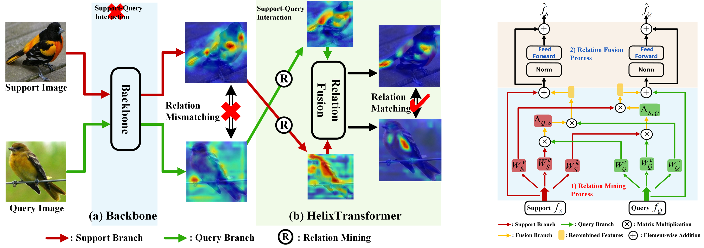

<div align="center">
  <h1>Inter-object Semantic Relation Modeling for Few-Shot
Fine-Grained Image Classification<br></h1>
</div>

<!-- <div align="center">
  <h3><a href=></a>, <a href=></a>, <a href=></a>, <a href=></a></h3>
</div> -->

<div align="center">
  <h4> <a href=>[paper]</a></h4>
</div>

<div align="center">
  
</div>

If you find our code or paper useful to your research work, please consider citing our work using the following bibtex:
```
@InProceedings{
}
```

## Code environment
This code requires Pytorch 1.7.1 and torchvision 0.8.2 or higher with cuda support. It has been tested on Ubuntu 18.04. 

You can create a conda environment with the correct dependencies using the following command lines:
```
conda env create -f environment.yml
conda activate (need to add env name)
```

## Setting up data
You must first specify the value of `data_path` in `config.yml`. This should be the absolute path of the folder where you plan to store all the data.

The following datasets are used in our paper: 
- CUB_200_2011 \[[Dataset Page](http://www.vision.caltech.edu/visipedia/CUB-200-2011.html)\]
- FGVC-Aircraft \[[Dataset Page](http://www.robots.ox.ac.uk/~vgg/data/fgvc-aircraft/)\]
- Stanford Dogs \[[Dataset Page](http://vision.stanford.edu/aditya86/ImageNetDogs/)\]
- Stanford Cars \[[Dataset Page](http://ai.stanford.edu/~jkrause/cars/car_dataset.html)\]
- NABirds \[[Dateset Page](https://dl.allaboutbirds.org/nabirds)\]


After setting up few-shot datasets following the steps above, the following folders will exist in your `data_path`:
- `CUB_crop`: 100/50/50 classes for train/validation/test, using bounding-box cropped images as input
- `Aircraft`: 60/15/55 classes for train/validation/test
- `StanfordDogs`: 70/20/30 classes for train/validation/test
- `StanfordCars`: 130/17/49 classes for train/validation/test
- `NABirds`: 350/66/139 classes for train/validation/test


## Train and test
For fine-grained few-shot classification, we provide the training and inference code for both HelixTransformer and our Relation Network baseline, as they appear in the paper. 

Training a model can be simply divided into two stages: 
- Stage one: Pretraining backbone, run the following command line
```
python train_classifier.py
```
datasets and backbone can be changed in `./configs/train_classifier.yaml`

- Stage two: Meta-train HelixTransformer, run the following command line
```
python train_meta_helix_transformer.py
```
datasets/backbone/HelixTransformer model and other configs can be changes in `./configs/train_helix_transformer.yaml`
 
 The trained model can be tested by running the following command line:
 ```
 python test_helix_transformer.py
 ```
 datasets/model path and other configs can be changed in `./configs/test_helix_transformer.yaml`
 
You can also train/test our meta baseline(Relation Network \[[paper](https://arxiv.org/pdf/1711.06025.pdf)\]) by running the following command line
```
python train_baseline.py
python test_baseline.py
```

## Selected few-shot classification results
Here we quote some performance comparisons from our paper on CUB, Stanford Cars, Stanford Dogs, NABirds, Aircraft and CUB &#8594; NABirds.

<p align="center">performance on Stanford Cars, Stanford Dogs, NABirds</p>
<table align="center">
    <tr align="center">
        <td rowspan="2">Method </td>
        <td rowspan="2">Setting</td>
        <td rowspan="2">backbone</td>
        <td colspan="2">Stanford Dogs </td>
        <td colspan="2">Stanford Cars </td>
        <td colspan="2">NABirds</td>
    </tr>
    <tr align="center">
        <td>1-shot </td>
        <td>5-shot</td>
        <td>1-shot </td>
        <td>5-shot</td>
        <td>1-shot </td>
        <td>5-shot</td>
    </tr>
    <tr align="center">
        <td>RelationNet (CVPR-18)</td>
        <td>In.</td>
        <td>Conv-4</td>
        <td>43.29±0.46</td>
        <td>55.15±0.39</td>
        <td>47.79±0.49</td>
        <td>60.60±0.41</td>
        <td>64.34±0.81</td>
        <td>77.52±0.60</td>
    </tr>
    <tr align="center">
        <td>CovaMNet (AAAI-19)</td>
        <td>In.</td>
        <td>Conv-4</td>
        <td>49.10±0.76</td>
        <td>63.04±0.65</td>
        <td>56.65±0.86</td>
        <td>71.33±0.62</td>
        <td>60.03±0.98</td>
        <td>75.63±0.79</td>
    </tr>
    <tr align="center">
        <td>DN4(CVPR-19)</td>
        <td>In.</td>
        <td>Conv-4</td>
        <td>45.73±0.76</td>
        <td>66.33±0.66</td>
        <td>61.51±0.85</td>
        <td>89.60±0.44</td>
        <td>51.81±0.91</td>
        <td>83.38±0.60</td>
    </tr>
    <tr align="center">
        <td>LRPABN(TMM-20)</td>
        <td>In.</td>
        <td>Conv-4</td>
        <td>45.72±0.75</td>
        <td>60.94±0.66</td>
        <td>60.28±0.76</td>
        <td>73.29±0.58</td>
        <td>67.73±0.81</td>
        <td>81.62±0.58</td>
    </tr>
    <tr align="center">
        <td>MattML(IJCAI-20)</td>
        <td>In.</td>
        <td>Conv-4</td>
        <td>54.84±0.53</td>
        <td>71.34±0.38</td>
        <td>66.11±0.54</td>
        <td>82.80±0.28</td>
        <td>-</td>
        <td>-</td>
    </tr>
    <tr align="center">
        <td>ATL-Net(IJCAI-20)</td>
        <td>In.</td>
        <td>Conv-4</td>
        <td>54.49±0.92</td>
        <td>73.20±0.69</td>
        <td>67.95±0.84</td>
        <td>89.16±0.48</td>
        <td>- </td>
        <td>-</td>
    </tr>
    <tr align="center">
        <td>FRN(CVPR-21)</td>
        <td>In.</td>
        <td>Conv-4</td>
        <td>49.37±0.20</td>
        <td>67.13±0.17</td>
        <td>58.90±0.22</td>
        <td>79.65±0.15</td>
        <td>-</td>
        <td>-</td>
    </tr>
    <tr align="center">
        <td>LSC+SSM(ACM MM-21)</td>
        <td>In.</td>
        <td>Conv-4</td>
        <td>55.53±0.45</td>
        <td>71.68±0.36</td>
        <td>70.13±0.48</td>
        <td>84.29±0.31</td>
        <td>75.60±0.49 </td>
        <td>87.21±0.29</td>
    </tr>
    <tr align="center">
        <td>Ours</td>
        <td>In.</td>
        <td>Conv-4</td>
        <td>58.02±0.49</td>
        <td>73.58±0.35</td>
        <td>76.08±0.35</td>
        <td>90.04±0.24</td>
        <td>77.68±0.47</td>
        <td>89.75±0.26</td>
    </tr>
    <tr align="center">
        <td>LSC+SSM(ACM MM-21)</td>
        <td>In.</td>
        <td>ResNet-12</td>
        <td>64.15±0.49</td>
        <td>78.28±0.32</td>
        <td>77.03±0.46</td>
        <td>88.85±0.46</td>
        <td>83.76±0.44</td>
        <td>92.61±0.23</td>
    </tr>
    <tr align="center">
        <td>Ours</td>
        <td>In.</td>
        <td>ResNet-12</td>
        <td>65.55±0.49</td>
        <td>79.51±0.35</td>
        <td>79.07±0.42</td>
        <td>90.42±0.15</td>
        <td>84.71±0.41</td>
        <td>92.66±0.17</td>
    </tr>
</table>

<p align="center">performance on CUB</p>
<table align="center">
  <tr align="center">
      <td rowspan="2">Method </td>
      <td rowspan="2">Setting</td>
      <td rowspan="2">backbone</td>
      <td colspan="2">CUB</td>
  </tr>
  <tr align="center">
      <td>1-shot</td>
      <td>5-shot</td>
  </tr>
  <tr align="center">
      <td>FEAT (CVPR-20) </td>
      <td>In.</td>
      <td>Conv-4</td>
      <td>68.87±0.22</td>
      <td>82.90±0.15</td>
  </tr>
  <tr align="center">
      <td>CTX (NIPS-20)</td>
      <td>In.</td>
      <td>Conv-4</td>
      <td>69.64</td>
      <td>87.31</td>
  </tr>
  <tr align="center">
      <td>FRN (CVPR-21)</td>
      <td>In.</td>
      <td>Conv-4</td>
      <td>73.48</td>
      <td>88.43</td>
  </tr>
  <tr align="center">
      <td>LSC+SSM (ACM MM-21)</td>
      <td>In.</td>
      <td>Conv-4</td>
      <td>73.07±0.46</td>
      <td>86.24±0.29</td>
  </tr>
  <tr align="center">
      <td>Ours</td>
      <td>In.</td>
      <td>Conv-4</td>
      <td>76.87±0.45</td>
      <td>91.01±0.24</td>
  </tr>
  <tr align="center">
      <td>DeepEMD (CVPR-20)</td>
      <td>In.</td>
      <td>ResNet-12</td>
      <td>75.65±0.83</td>
      <td>88.69±0.50</td>
  </tr>
  <tr align="center">
      <td>ICI (CVPR-20) </td>
      <td>In.</td>
      <td>ResNet-12</td>
      <td>76.16</td>
      <td>90.32</td>
  </tr>
  <tr align="center">
      <td>CTX (NIPS-20)</td>
      <td>In.</td>
      <td>ResNet-12</td>
      <td>78.47</td>
      <td>90.9</td>
  </tr>
  <tr align="center">
      <td>FRN (Baseline)</td>
      <td>In.</td>
      <td>ResNet-12</td>
      <td>80.80±0.20 </td>
      <td> -</td>
  </tr>
  <tr align="center">
      <td>FRN (CVPR-21) </td>
      <td>In.</td>
      <td>ResNet-12</td>
      <td>83.16</td>
      <td>92.59</td>
  </tr>
  <tr align="center">
      <td>LSC+SSM (ACM MM-21) </td>
      <td>In.</td>
      <td>ResNet-12</td>
      <td>77.77±0.44</td>
      <td>89.87±0.24</td>
  </tr>
  <tr align="center">
      <td>Ours (Baseline)</td>
      <td>In.</td>
      <td>ResNet-12</td>
      <td>72.61±0.47</td>
      <td>85.60±0.29</td>
  </tr>
  <tr align="center">
      <td>Ours</td>
      <td>In.</td>
      <td>ResNet-12</td>
      <td>81.66±0.30</td>
      <td>91.11±0.17</td>
  </tr>
</table>


<p align="center">performance on Aircraft</p>
<table align="center">
  <tr align="center">
      <td rowspan="2">Method </td>
      <td rowspan="2">Setting</td>
      <td rowspan="2">backbone</td>
      <td colspan="2">Aircaft</td>
  </tr>
  <tr align="center">
      <td>1-shot</td>
      <td>5-shot</td>
  </tr>
  <tr align="center">
      <td>ProtoNet (NIPS-17) </td>
      <td>In.</td>
      <td>Conv-4</td>
      <td>47.72</td>
      <td>69.42</td>
  </tr>
  <tr align="center">
      <td>DSN (CVPR-20) </td>
      <td>In.</td>
      <td>Conv-4</td>
      <td>49.63</td>
      <td>66.36</td>
  </tr>
  <tr align="center">
      <td>CTX (NIPS-20)</td>
      <td>In.</td>
      <td>Conv-4</td>
      <td>49.67</td>
      <td>69.06</td>
  </tr>
  <tr align="center">
      <td>FRN (CVPR-21)</td>
      <td>In.</td>
      <td>Conv-4</td>
      <td>53.2</td>
      <td>71.17</td>
  </tr>
  <tr align="center">
      <td>Ours</td>
      <td>In.</td>
      <td>Conv-4</td>
      <td>69.49±0.57</td>
      <td>79.35±0.40</td>
  </tr>
  <tr align="center">
      <td>ProtoNet (NIPS-17) </td>
      <td>In.</td>
      <td>ResNet-12</td>
      <td>66.57</td>
      <td>82.37</td>
  </tr>
  <tr align="center">
      <td>DSN (CVPR-20)</td>
      <td>In.</td>
      <td>ResNet-12</td>
      <td>68.16</td>
      <td>81.85</td>
  </tr>
  <tr align="center">
      <td>CTX (NIPS-20)</td>
      <td>In.</td>
      <td>ResNet-12</td>
      <td>65.6</td>
      <td>80.2</td>
  </tr>
  <tr align="center">
      <td>FRN (CVPR-21) </td>
      <td>In.</td>
      <td>ResNet-12</td>
      <td>70.17</td>
      <td>83.81</td>
  </tr>
  <tr align="center">
      <td>Ours</td>
      <td>In.</td>
      <td>ResNet-12</td>
      <td>73.47±0.55</td>
      <td>82.94±0.41</td>
  </tr>
</table>

<p align="center">performance on CUB &#8594; NABirds</p>
<table align="center">
    <tr align="center">
        <td rowspan="2">Method </td>
        <td rowspan="2">backbone</td>
        <td colspan="2">CUB→NABirds</td>
    </tr>
    <tr align="center">
        <td>1-shot</td>
        <td>5-shot</td>
    </tr>
    <tr align="center">
        <td>LSC+SSM (Baseline) </td>
        <td>ResNet-12</td>
        <td>45.70±0.45</td>
        <td>63.84±0.40</td>
    </tr>
    <tr align="center">
        <td>LSC+SSM (ACM MM-21)</td>
        <td>ResNet-12</td>
        <td>48.50±0.48</td>
        <td>66.35±0.41</td>
    </tr>
    <tr align="center">
        <td>Ours (Baseline)</td>
        <td>Conv-4</td>
        <td>43.55±0.45</td>
        <td>55.53±0.42</td>
    </tr>
    <tr align="center">
        <td>Ours</td>
        <td>Conv-4</td>
        <td>48.58±0.47</td>
        <td>62.04±0.42</td>
    </tr>
    <tr align="center">
        <td>Ours (Baseline)</td>
        <td>ResNet-12</td>
        <td>46.22±0.45</td>
        <td>63.23±0.42</td>
    </tr>
    <tr align="center">
        <td>Ours</td>
        <td>ResNet-12</td>
        <td>51.19±0.49</td>
        <td>66.40±0.26</td>
    </tr>
</table>

## Contact
We have tried our best to verify the correctness of our released data, code and trained model weights. 
However, there are a large number of experiment settings, all of which have been extracted and reorganized from our original codebase. 
There may be some undetected bugs or errors in the current release. 
If you encounter any issues or have questions about using this code, please feel free to contact us via zhangb18@fudan.edu.cn and jkyuan18@fudan.edu.cn.

## References


