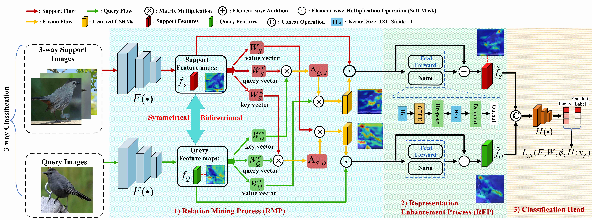
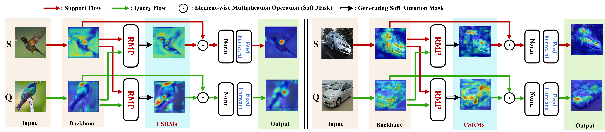

<div align="center">
  <h1>Learning Cross-Image Object Semantic Relation in Transformer for Few-Shot Fine-Grained Image Classification<br></h1>
</div>

<!-- <div align="center">
  <h3><a href=></a>, <a href=></a>, <a href=></a>, <a href=></a></h3>
</div> -->

<div align="center">
  <h4> <a href=>[paper]</a></h4>
</div>

<div align="center">
  
</div>

[//]: # (If you find our code or paper useful to your research work, please consider citing our work using the following bibtex:)

[//]: # (```)

[//]: # (@InProceedings{)

[//]: # (})

[//]: # (```)

## Abstract
Few-shot fine-grained learning aims to classify a query image into one of a set of support categories with fine-grained differences. Although learning different objects' local differences via Deep Neural Networks has achieved success, how to exploit the query-support cross-image object semantic relations in Transformer-based architecture remains under-explored in the few-shot fine-grained scenario. In this work, we propose a Transformer-based double-helix model, namely HelixFormer, to achieve the cross-image object semantic relation mining in a bidirectional and symmetrical manner. The HelixFormer consists of two steps: 1) Relation Mining Process (RMP) across different branches, and 2) Representation Enhancement Process (REP) within each individual branch. By the designed RMP, each branch can extract fine-grained object-level Cross-image Semantic Relation Maps (CSRMs) using information from the other branch, ensuring better cross-image interaction in semantically related local object regions. Further, with the aid of CSRMs, the developed REP can strengthen the extracted features for those discovered semantically-related local regions in each branch, boosting the model's ability to distinguish subtle feature differences of fine-grained objects. Extensive experiments conducted on five public fine-grained benchmarks demonstrate that HelixFormer can effectively enhance the cross-image object semantic relation matching for recognizing fine-grained objects, achieving much better performance over most state-of-the-art methods under 1-shot and 5-shot scenarios.
## Code environment
This code requires Pytorch 1.7.1 and torchvision 0.8.2 or higher with cuda support. It has been tested on Ubuntu 18.04. 

For detailed dependencies, please see our requirements.txt.

## Setting up data
You must first specify the value of `DEFAULT_ROOT` in `./datasets/datasets.py`. This should be the absolute path of the datasets.

The following datasets are used in our paper: 
- CUB_200_2011 \[[Dataset Page](http://www.vision.caltech.edu/visipedia/CUB-200-2011.html)\]
- FGVC-Aircraft \[[Dataset Page](http://www.robots.ox.ac.uk/~vgg/data/fgvc-aircraft/)\]
- Stanford Dogs \[[Dataset Page](http://vision.stanford.edu/aditya86/ImageNetDogs/)\]
- Stanford Cars \[[Dataset Page](http://ai.stanford.edu/~jkrause/cars/car_dataset.html)\]
- NABirds \[[Dateset Page](https://dl.allaboutbirds.org/nabirds)\]


## Train and Test
For fine-grained few-shot classification, we provide the training and inference code for both HelixFormer and our Relation Network baseline, as they appear in the paper. 

Training a model can be simply divided into two stages: 
- Stage one: Pretraining backbone, run the following command line
```
python train_classifier.py
```
datasets and backbone can be changed in `./configs/train_classifier.yaml`

- Stage two: Meta-train HelixFormer, run the following command line
```
python train_meta_helix_transformer.py 
```
datasets/backbone/HelixTransformer model and other configs can be changes in `./configs/train_helix_transformer.yaml`
 
 The trained model can be tested by running the following command line:
 ```
 python test_helix_transformer.py
 ```
 datasets/model path and other configs can be changed in `./configs/test_helix_transformer.yaml`
 
You can also train/test our meta baseline(Relation Network \[[paper](https://arxiv.org/pdf/1711.06025.pdf)\]) by running the following command line
```
# train
python train_classifier.py
python train_baseline.py
# test
python test_baseline.py
```

## Selected few-shot classification results and Feature Visualization
Here we quote some performance comparisons from our paper on CUB, Stanford Cars, Stanford Dogs, NABirds, Aircraft and CUB &#8594; NABirds.

<p align="center"><b>Table 1. Performance on Stanford Cars, Stanford Dogs, NABirds</b></p>
<table align="center">
    <tr align="center">
        <td rowspan="2">Method </td>
        <td rowspan="2">Setting</td>
        <td rowspan="2">backbone</td>
        <td colspan="2">Stanford Dogs </td>
        <td colspan="2">Stanford Cars </td>
        <td colspan="2">NABirds</td>
    </tr>
    <tr align="center">
        <td>1-shot </td>
        <td>5-shot</td>
        <td>1-shot </td>
        <td>5-shot</td>
        <td>1-shot </td>
        <td>5-shot</td>
    </tr>
    <tr align="center">
        <td>RelationNet (CVPR-18)</td>
        <td>In.</td>
        <td>Conv-4</td>
        <td>43.29±0.46</td>
        <td>55.15±0.39</td>
        <td>47.79±0.49</td>
        <td>60.60±0.41</td>
        <td>64.34±0.81</td>
        <td>77.52±0.60</td>
    </tr>
    <tr align="center">
        <td>CovaMNet (AAAI-19)</td>
        <td>In.</td>
        <td>Conv-4</td>
        <td>49.10±0.76</td>
        <td>63.04±0.65</td>
        <td>56.65±0.86</td>
        <td>71.33±0.62</td>
        <td>60.03±0.98</td>
        <td>75.63±0.79</td>
    </tr>
    <tr align="center">
        <td>DN4(CVPR-19)</td>
        <td>In.</td>
        <td>Conv-4</td>
        <td>45.73±0.76</td>
        <td>66.33±0.66</td>
        <td>61.51±0.85</td>
        <td>89.60±0.44</td>
        <td>51.81±0.91</td>
        <td>83.38±0.60</td>
    </tr>
    <tr align="center">
        <td>LRPABN(TMM-20)</td>
        <td>In.</td>
        <td>Conv-4</td>
        <td>45.72±0.75</td>
        <td>60.94±0.66</td>
        <td>60.28±0.76</td>
        <td>73.29±0.58</td>
        <td>67.73±0.81</td>
        <td>81.62±0.58</td>
    </tr>
    <tr align="center">
        <td>MattML(IJCAI-20)</td>
        <td>In.</td>
        <td>Conv-4</td>
        <td>54.84±0.53</td>
        <td>71.34±0.38</td>
        <td>66.11±0.54</td>
        <td>82.80±0.28</td>
        <td>-</td>
        <td>-</td>
    </tr>
    <tr align="center">
        <td>ATL-Net(IJCAI-20)</td>
        <td>In.</td>
        <td>Conv-4</td>
        <td>54.49±0.92</td>
        <td>73.20±0.69</td>
        <td>67.95±0.84</td>
        <td>89.16±0.48</td>
        <td>- </td>
        <td>-</td>
    </tr>
    <tr align="center">
        <td>FRN(CVPR-21)</td>
        <td>In.</td>
        <td>Conv-4</td>
        <td>49.37±0.20</td>
        <td>67.13±0.17</td>
        <td>58.90±0.22</td>
        <td>79.65±0.15</td>
        <td>-</td>
        <td>-</td>
    </tr>
    <tr align="center">
        <td>LSC+SSM(ACM MM-21)</td>
        <td>In.</td>
        <td>Conv-4</td>
        <td>55.53±0.45</td>
        <td>71.68±0.36</td>
        <td>70.13±0.48</td>
        <td>84.29±0.31</td>
        <td>75.60±0.49 </td>
        <td>87.21±0.29</td>
    </tr>
    <tr align="center">
        <td>Ours</td>
        <td>In.</td>
        <td>Conv-4</td>
        <td>59.81±0.50</td>
        <td>73.40±0.36</td>
        <td>75.46±0.37</td>
        <td>89.68±0.35</td>
        <td>78.63±0.48</td>
        <td>90.06±0.26</td>
    </tr>
    <tr align="center">
        <td>LSC+SSM(ACM MM-21)</td>
        <td>In.</td>
        <td>ResNet-12</td>
        <td>64.15±0.49</td>
        <td>78.28±0.32</td>
        <td>77.03±0.46</td>
        <td>88.85±0.46</td>
        <td>83.76±0.44</td>
        <td>92.61±0.23</td>
    </tr>
    <tr align="center">
        <td>Ours</td>
        <td>In.</td>
        <td>ResNet-12</td>
        <td>65.92±0.49</td>
        <td>80.65±0.36</td>
        <td>79.40±0.43</td>
        <td>92.26±0.15</td>
        <td>84.51±0.41</td>
        <td>93.11±0.19</td>
    </tr>
</table>

<p align="center"><b>Table 2. Performance on CUB</b></p>
<table align="center">
  <tr align="center">
      <td rowspan="2">Method </td>
      <td rowspan="2">Setting</td>
      <td rowspan="2">backbone</td>
      <td colspan="2">CUB</td>
  </tr>
  <tr align="center">
      <td>1-shot</td>
      <td>5-shot</td>
  </tr>
  <tr align="center">
      <td>FEAT (CVPR-20) </td>
      <td>In.</td>
      <td>Conv-4</td>
      <td>68.87±0.22</td>
      <td>82.90±0.15</td>
  </tr>
  <tr align="center">
      <td>CTX (NIPS-20)</td>
      <td>In.</td>
      <td>Conv-4</td>
      <td>69.64</td>
      <td>87.31</td>
  </tr>
  <tr align="center">
      <td>FRN (CVPR-21)</td>
      <td>In.</td>
      <td>Conv-4</td>
      <td>73.48</td>
      <td>88.43</td>
  </tr>
  <tr align="center">
      <td>LSC+SSM (ACM MM-21)</td>
      <td>In.</td>
      <td>Conv-4</td>
      <td>73.07±0.46</td>
      <td>86.24±0.29</td>
  </tr>
  <tr align="center">
      <td>Ours</td>
      <td>In.</td>
      <td>Conv-4</td>
      <td>79.34±0.45</td>
      <td>91.01±0.24</td>
  </tr>
  <tr align="center">
      <td>DeepEMD (CVPR-20)</td>
      <td>In.</td>
      <td>ResNet-12</td>
      <td>75.65±0.83</td>
      <td>88.69±0.50</td>
  </tr>
  <tr align="center">
      <td>ICI (CVPR-20) </td>
      <td>In.</td>
      <td>ResNet-12</td>
      <td>76.16</td>
      <td>90.32</td>
  </tr>
  <tr align="center">
      <td>CTX (NIPS-20)</td>
      <td>In.</td>
      <td>ResNet-12</td>
      <td>78.47</td>
      <td>90.9</td>
  </tr>
  <tr align="center">
      <td>FRN (Baseline)</td>
      <td>In.</td>
      <td>ResNet-12</td>
      <td>80.80±0.20 </td>
      <td> -</td>
  </tr>
  <tr align="center">
      <td>FRN (CVPR-21) </td>
      <td>In.</td>
      <td>ResNet-12</td>
      <td>83.16</td>
      <td>92.59</td>
  </tr>
  <tr align="center">
      <td>LSC+SSM (ACM MM-21) </td>
      <td>In.</td>
      <td>ResNet-12</td>
      <td>77.77±0.44</td>
      <td>89.87±0.24</td>
  </tr>
  <tr align="center">
      <td>Ours (Baseline)</td>
      <td>In.</td>
      <td>ResNet-12</td>
      <td>72.61±0.47</td>
      <td>85.60±0.29</td>
  </tr>
  <tr align="center">
      <td>Ours</td>
      <td>In.</td>
      <td>ResNet-12</td>
      <td>81.66±0.30</td>
      <td>91.83±0.17</td>
  </tr>
</table>


<p align="center"><b>Table 3. Performance on Aircraft</b></p>
<table align="center">
  <tr align="center">
      <td rowspan="2">Method </td>
      <td rowspan="2">Setting</td>
      <td rowspan="2">backbone</td>
      <td colspan="2">Aircaft</td>
  </tr>
  <tr align="center">
      <td>1-shot</td>
      <td>5-shot</td>
  </tr>
  <tr align="center">
      <td>ProtoNet (NIPS-17) </td>
      <td>In.</td>
      <td>Conv-4</td>
      <td>47.72</td>
      <td>69.42</td>
  </tr>
  <tr align="center">
      <td>DSN (CVPR-20) </td>
      <td>In.</td>
      <td>Conv-4</td>
      <td>49.63</td>
      <td>66.36</td>
  </tr>
  <tr align="center">
      <td>CTX (NIPS-20)</td>
      <td>In.</td>
      <td>Conv-4</td>
      <td>49.67</td>
      <td>69.06</td>
  </tr>
  <tr align="center">
      <td>FRN (CVPR-21)</td>
      <td>In.</td>
      <td>Conv-4</td>
      <td>53.2</td>
      <td>71.17</td>
  </tr>
  <tr align="center">
      <td>Ours</td>
      <td>In.</td>
      <td>Conv-4</td>
      <td>70.37±0.57</td>
      <td>79.80±0.40</td>
  </tr>
  <tr align="center">
      <td>ProtoNet (NIPS-17) </td>
      <td>In.</td>
      <td>ResNet-12</td>
      <td>66.57</td>
      <td>82.37</td>
  </tr>
  <tr align="center">
      <td>DSN (CVPR-20)</td>
      <td>In.</td>
      <td>ResNet-12</td>
      <td>68.16</td>
      <td>81.85</td>
  </tr>
  <tr align="center">
      <td>CTX (NIPS-20)</td>
      <td>In.</td>
      <td>ResNet-12</td>
      <td>65.6</td>
      <td>80.2</td>
  </tr>
  <tr align="center">
      <td>FRN (CVPR-21) </td>
      <td>In.</td>
      <td>ResNet-12</td>
      <td>70.17</td>
      <td>83.81</td>
  </tr>
  <tr align="center">
      <td>Ours</td>
      <td>In.</td>
      <td>ResNet-12</td>
      <td>74.01±0.54</td>
      <td>83.11±0.41</td>
  </tr>
</table>

<p align="center"> <b>Table 4. Performance on CUB &#8594; NABirds </b></p>
<table align="center">
    <tr align="center">
        <td rowspan="2">Method </td>
        <td rowspan="2">backbone</td>
        <td colspan="2">CUB→NABirds</td>
    </tr>
    <tr align="center">
        <td>1-shot</td>
        <td>5-shot</td>
    </tr>
    <tr align="center">
        <td>LSC+SSM (Baseline) </td>
        <td>ResNet-12</td>
        <td>45.70±0.45</td>
        <td>63.84±0.40</td>
    </tr>
    <tr align="center">
        <td>LSC+SSM (ACM MM-21)</td>
        <td>ResNet-12</td>
        <td>48.50±0.48</td>
        <td>66.35±0.41</td>
    </tr>
    <tr align="center">
        <td>Ours (Baseline)</td>
        <td>Conv-4</td>
        <td>43.55±0.45</td>
        <td>55.53±0.42</td>
    </tr>
    <tr align="center">
        <td>Ours</td>
        <td>Conv-4</td>
        <td>47.87±0.47</td>
        <td>61.47±0.41</td>
    </tr>
    <tr align="center">
        <td>Ours (Baseline)</td>
        <td>ResNet-12</td>
        <td>46.22±0.45</td>
        <td>63.23±0.42</td>
    </tr>
    <tr align="center">
        <td>Ours</td>
        <td>ResNet-12</td>
        <td>50.56±0.48</td>
        <td>66.13±0.41</td>
    </tr>
</table>

<p align="center"><b>Feature Visualization</b></p>
<div align="center">
  
</div>


## Contact
We have tried our best to verify the correctness of our released data, code and trained model weights. 
However, there are a large number of experiment settings, all of which have been extracted and reorganized from our original codebase. 
There may be some undetected bugs or errors in the current release. 
If you encounter any issues or have questions about using this code, please feel free to contact us via bo.zhangzx@gmail.com and jkyuan18@fudan.edu.cn.

## References
[1] Flood Sung, Yongxin Yang, Li Zhang, Tao Xiang, Philip HS Torr, and Timothy M Hospedales. 2018. Learning to compare: Relation network for few-shot learning. In CVPR.

[2] Wenbin Li, Jinglin Xu, Jing Huo, Lei Wang, Yang Gao, and Jiebo Luo. 2019. Distribution consistency based covariance metric networks for few-shot learning. In AAAI.

[3] Wenbin Li, Lei Wang, Jinglin Xu, Jing Huo, Yang Gao, and Jiebo Luo. 2019. Revisiting local descriptor based image-to-class measure for few-shot learning. In CVPR.

[4] Yaohui Zhu, Chenlong Liu, and Shuqiang Jiang. 2020. Multi-attention meta learning for few-shot fine-grained image recognition. In IJCAI.

[5] Chuanqi Dong, Wenbin Li, Jing Huo, Zheng Gu, and Yang Gao. 2020. Learning Task-aware Local Representations for Few-shot Learning. In IJCAI

[6] Davis Wertheimer, Luming Tang, and Bharath Hariharan. 2021. Few-Shot Classification With Feature Map Reconstruction Networks. In CVPR.

[7] Yike Wu, Bo Zhang, Gang Yu, Weixi Zhang, Bin Wang, Tao Chen, and Jiayuan Fan. 2021. Object-aware Long-short-range Spatial Alignment for Few-Shot Fine-Grained Image Classification. In Proceedings of the 29th ACM International Conference on Multimedia. 107–115.

[8] Han-Jia Ye, Hexiang Hu, De-Chuan Zhan, and Fei Sha. 2020. Few-shot learning via embedding adaptation with set-to-set functions. In CVPR.

[9] Carl Doersch, Ankush Gupta, and Andrew Zisserman. 2020. Crosstransformers: spatially-aware few-shot transfer. In NeurIPS.

[10] Jake Snell, Kevin Swersky, and Richard Zemel. 2017. Prototypical networks for few-shot learning. In NeurIPS

[11] Chi Zhang, Yujun Cai, Guosheng Lin, and Chunhua Shen. 2020. DeepEMD: Few-Shot Image Classification With Differentiable Earth Mover’s Distance and Structured Classifiers. In CVPR.

[12] Yikai Wang, Chengming Xu, Chen Liu, Li Zhang, and Yanwei Fu. 2020. Instance credibility inference for few-shot learning. In CVPR

[13] Christian Simon, Piotr Koniusz, Richard Nock, and Mehrtash Harandi. 2020. Adaptive subspaces for few-shot learning. In CVPR.

